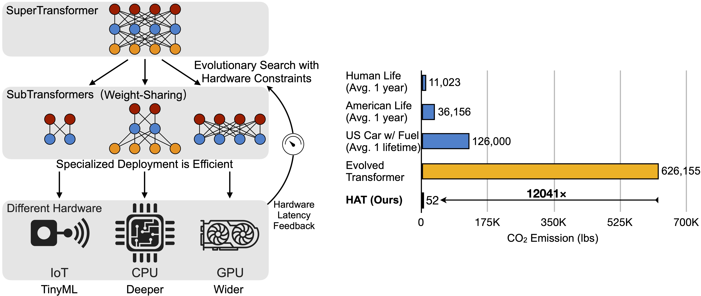
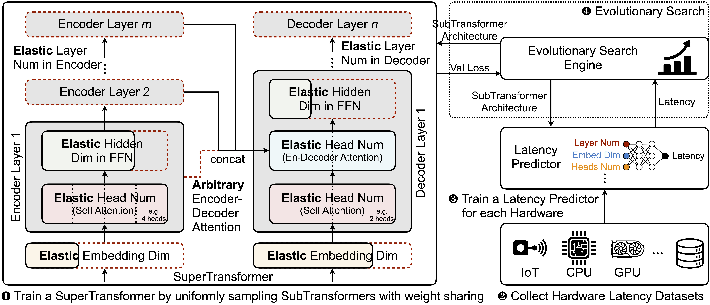

## Overview
We release the PyTorch code and 50 pre-trained models for HAT: Hardware-Aware Transformers. Within a Transformer supernet (SuperTransformer), we efficiently search for a specialized fast model (SubTransformer) for each hardware with latency feedback. The search cost is reduced by over 10000×.

HAT Framework overview:

HAT models achieve up to 3× speedup and 3.7× smaller model size with no performance loss.

